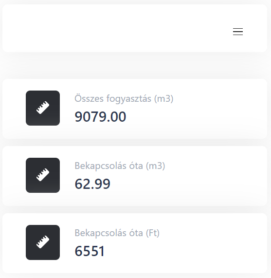

# GasMeter

Counts how many liters of **gas** has been used. The counting relies on the [reflective digit](https://learn.openenergymonitor.org/electricity-monitoring/pulse-counting/gas-meter-monitoring#optical-counting) of the gas meter.

Uses [ESP-DASH](https://github.com/ayushsharma82/ESP-DASH) to display the information (an extended version of it where there is also a **Slider Button** component).

## Configuration

Currently the configuration informations are hard-coded (or can be changed by **GET** request). 
Working on the UI to allow configuration and callibration through the UI.

## Hardware used
| [**HOA1180-002**](https://eu.mouser.com/ProductDetail/Honeywell/HOA1180-002?qs=OmWMh1k3VigON8x9P7dPdA%3D%3D)                                                                                                                                                                                                                                                                                             | **Phototransistor connected to A0**                      |
|----------------------------------------------------------------------------------------------------------------------------------------------------------------------------------------------------------------------------------------------------------------------------------------------------------------------------------------------------------------------------------------------------------|----------------------------------------------------------|
| [**TTGO T-OI ESP8266**](https://www.aliexpress.com/item/4001222097785.html)                                                                                                                                                                                                                                                                                                                              | **ESP8266 with battery**                                 |
| [**Real Time Clock/Data Logger Shield**](https://www.aliexpress.com/item/4000253681172.html?spm=a2g0o.productlist.0.0.1a9e5e44356y6t&algo_pvid=3ebcc57b-dae6-4980-98db-7571979ce8c2&algo_exp_id=3ebcc57b-dae6-4980-98db-7571979ce8c2-0&pdp_ext_f=%7B%22sku_id%22%3A%2210000001024571580%22%7D&pdp_npi=2%40dis%21USD%21%212.35%21%21%21%21%21%402101e9d216554085175255723e07e8%2110000001024571580%21sea) | **RTC + Logging (data aggregation for future purposes)**

## Screenshots
